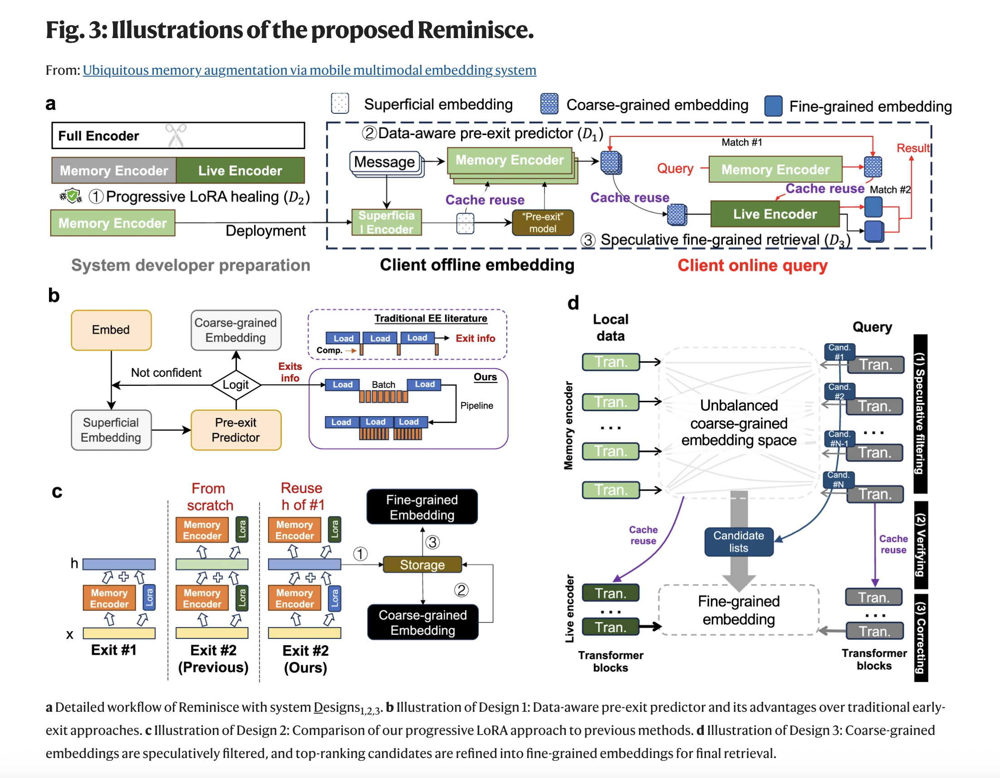
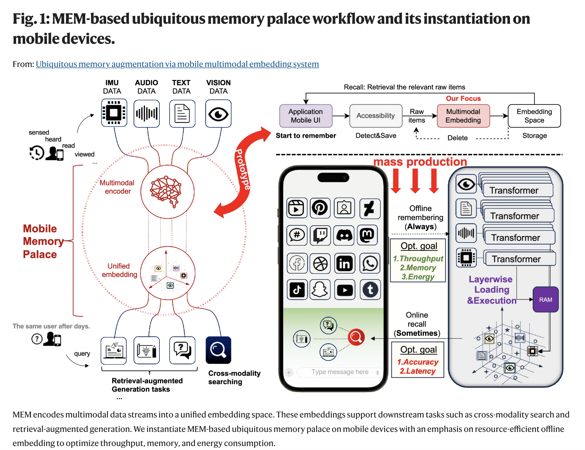

+++
date = '2024-03-05'
draft = false
title = 'EMbeddings Contrained'
tags = ['embeddings', 'embeddings_contrained','Reminesce','']
+++

## Ubiquitous memory augmentation via mobile multimodal embedding system, 2025

### Reference
- Paper: [https://www.nature.com/articles/s41467-025-60802-5](https://www.nature.com/articles/s41467-025-60802-5)
- [Supplementary material](https://pmc.ncbi.nlm.nih.gov/articles/instance/12179270/bin/41467_2025_60802_MOESM1_ESM.pdf)
- [Code](https://github.com/caidongqi/Mobile-Search-Engine/tree/pc)

### Overview
Shares a new approach to multi-modal embeddings on a resource constrained device, such as your smartphone, relative to cloud. 

### Diagrams
{{ $image := .Resources.Get "reminesce_architecture.png" }}

### What's new
The core idea is to generate "coarse-grained embeddings" via a predictor-guided early-exit strategy to efficiently identify likely candidates during retrieval, while using lightweight adapters and refined retrieval to maintain accuracy. The framework is aptly named "Reminisce".

### Highlights

1) **What does efficiency mean here?**
    - Reducing energy costs and query latency while maximizing throughout and maximizing retrieval accuracy

2) **What are coarse embeddings?**
    - Embeddings generated by using a subset of intermediate layers of the model
    - Related concept "superficial embeddings"

3) **How do we know which subset of layers to pick?**
    - Exit points 
    - A small predictor model looks at intermediate embeddings and predicts the best exit layer ahead of time.

4) **Coarse embeddings may affect retrieval accuracy**
    - Yes, they do. The degration is mitigated through finetuning 

5) **Any particular approach to finetuning?**
    - Uses LoRA

6) **LoRA for each exit point/layer? That would be too many LoRAs**
    - Uses "Progressive LoRA healing" to have a single LoRA suite covering all exit points. 
    - The strategy progressively increases the "tuning depth (number of shared layers) at later exits"

7) **Quite a bit of optimizations for encoding. Anything else?**
    - Cache intermediate activations (quantized to INT4) so they can be reused, avoiding re-computation.
    - Cache release/invalidation strategy to keep memory low.

8) **What happens during query encoding?**
- Seems usual encoding of query does not result in expected retrieval accuracy

9) **So, how are queries encoded?**
    - A query is encoded at different granularities
    - Top-k candidates at each granularity are selected, then overall top-k which are then compared against the embeddings. 
    - Called "speculative fine-grained retrieval"

### Summary
This is a multi-pronged approach to optimize encoding and retrieval on constrained platforms. It will be interesting to see how quickly and broadly the industry adopts it.

